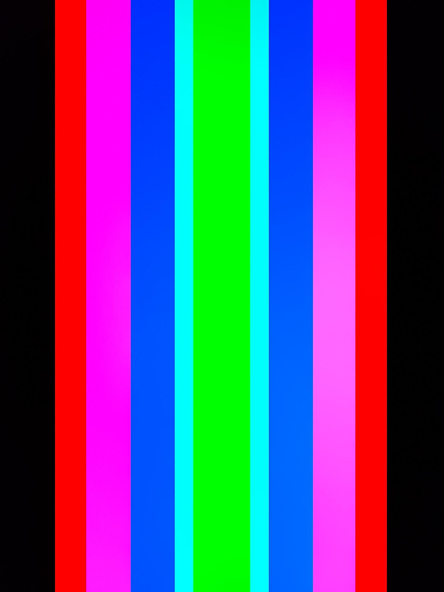
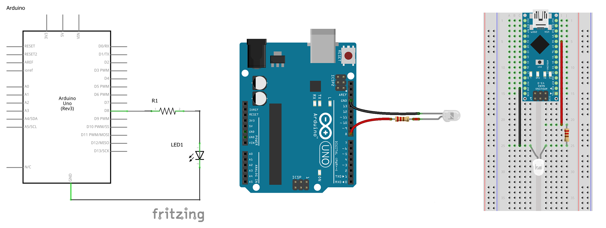
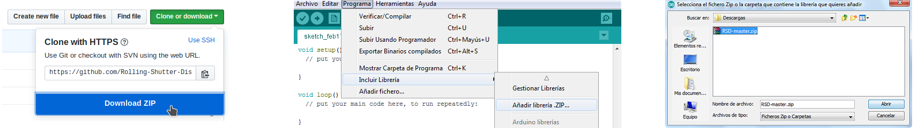
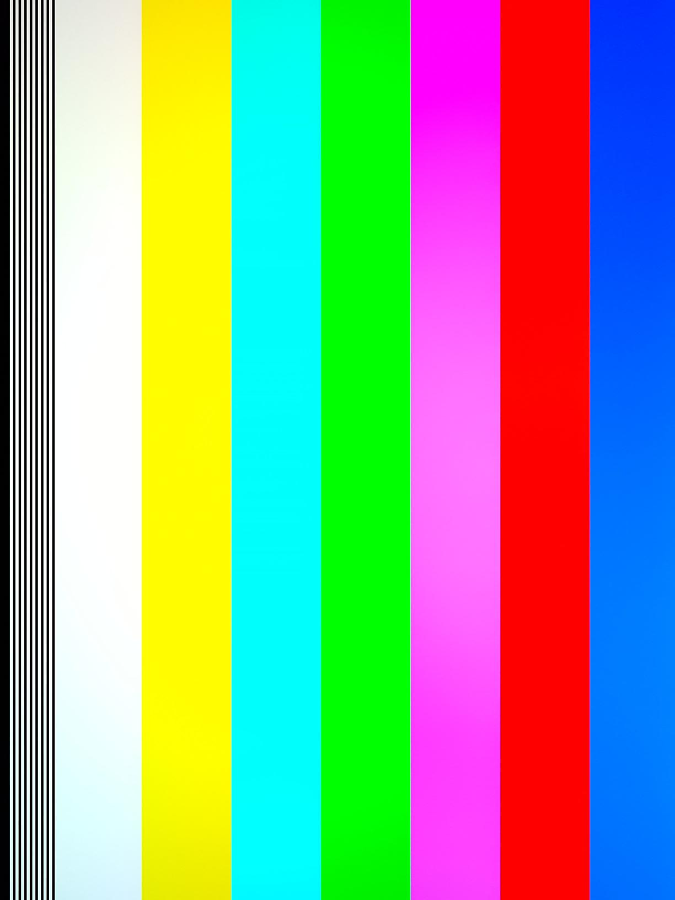
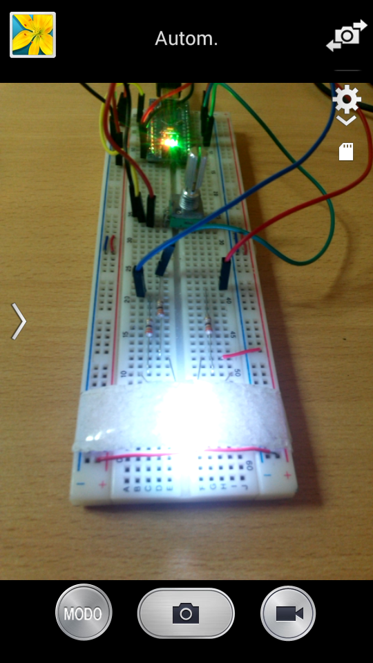
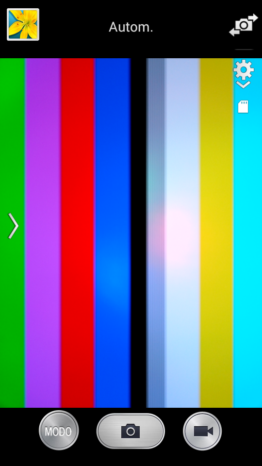
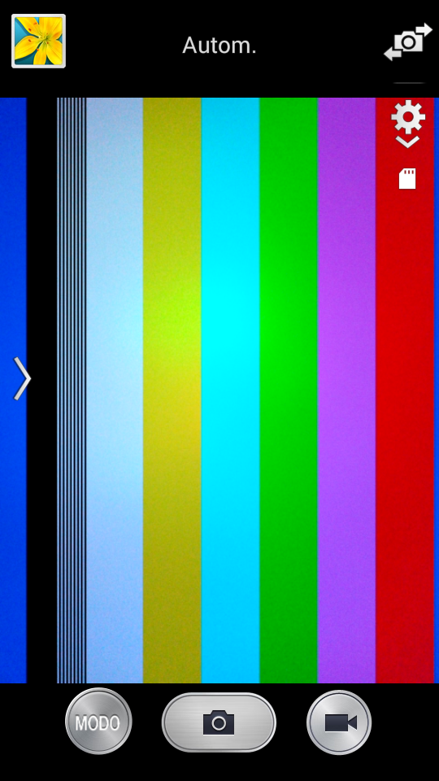

# RSD - Rolling Shutter Display Library 

Photos   

YouTube videos  

## What is a Rolling Shutter Display (RSD)?

A Rolling Shutter Display, abbreviated RSD, is a device capable of producing images and videos through the set of a digital camera (CMOS) and one or more [LEDs](https://en.wikipedia.org/wiki/Light-emitting_diode), making use of the phenomenon of interference between a signal responsible for turning on and off the LED and the scanning frequency of the camera ([Rolling Shutter](https://en.wikipedia.org/wiki/Rolling_shutter)).

Rolling Shutter Display Library is a library for Arduino UNO and the like, *Arduino Nano, Mini, Adafruit METRO 328, LilyPad Simple Board, etc; that is, architectures based on the ATmega328* microcontroller. It provides methods and functions to tune and control the LEDs, in addition to a simple programming interface (API) to facilitate on-screen drawing.

This library allows us to create an RSD with only Arduino and an LED!

## Hardware
Arduino already has a built-in LED and in fact it is possible to build an RSD with it, so in principle, an Arduino is all that is needed. However, in order to appreciate the phenomenon more effectively through a cell phone camera, for example, it is convenient to use a high-brightness LED that is ***as close as possible to the camera***.

### Minimal circuit
 

The minimal circuit is an LED connected to *any* of the Arduino's pins with its corresponding current limiting resistor.
The resistance value will depend on the color of the LED and the current that we want to circulate through it. Keep in mind that the maximum current that an Arduino pin can supply is around 40 mA, but it is recommended not to exceed 20 mA. For most cases, a 220 Ω resistor it will be enough.    
Another issue to consider is the orientation of the LED. In the proposed circuit the cathode is connected to the common (GND), this configuration is known as the common cathode. In 5mm LEDs, the cathode is identified by a flat mark on the package, and its *terminal is shorter* than the anode. There would be no problem connecting it the other way around, that is, in the common anode configuration (in this case the anode is connected to positive VCC, and the cathode through the resistance to the Arduino pin); in any case, when programming we will have to tell the library what configuration it is in.
We will tune the RSD in this scheme through the serial port.

### Recommended circuit
 

Component list:

- 1 Arduino
- 1 common anode 5mm RGB LED (if possible diffused, if not we will add a diffuser)
- 3 resistors 220 Ω
- 1 potentiometer between 5 kΩ ~ 10 kΩ

The RGB LED will allow us to obtain, in addition to its 3 colors (red, green and blue), its combinations; that is, yellow (red + green), cyan (green + blue), magenta (blue + red), and white (red + green + blue). Counting black as a color, this mode allows us to represent 8 colors. The same considerations regarding the LED taken into account in the minimal circuit apply in this case: an RGB LED is still a set of 3 LEDs.
The potentiometer on the other hand, provides more dynamic control of the tuning of the RSD.

## Software: Library installation

- Download this repository
- In the Arduino development environment (IDE), go to Program > Include Library > Add .ZIP Library
- We look for the Zip file of the repository that we just downloaded and click on open

 

Once the library is installed, we will load the first Sketch to verify that everything is working. For this go to File > Examples > RSD-master > TestScreen_One_LED (in the case of the minimal circuit) or TestScreen_RGB_LED (in the case of the recommended circuit).    
Once we load the Sketch, the LED with the naked eye should be flickering. As we move the cell phone camera closer and closer to the LED, we should be able to see something similar to the following patterns:

To improve the definition and stability of the image we must make some adjustments that are detailed below.

## Adjustments

### Camera

#### Distance

The key to getting a good RSD image is **getting the camera as close as possible** to the LED, or vice versa; if possible that they are in contact and centered.

#### Film speed (ISO)

Each camera may or may not modify different parameters in the different modes it has. To improve the definition of the image we must increase the [ISO](https://en.wikipedia.org/wiki/Film_speed) that is generally accessed in professional or manual mode.

### LED

#### Brightness 

It may be the case that the camera does not allow to control the ISO or, for example, it does allow to control it in the professional camera mode but not in the video mode. The solution in those cases is to increase the power of the LED.
Increasing the power in addition to improving the definition, also allows the use of better diffusers (see below) and increases the area and distance at which the RSD image can be observed. Of course there is a limit, after a certain threshold the camera becomes saturated and any color looks white.
To increase power, the proposed circuit must be modified, a topic that is beyond the scope of this document.

#### Diffuser

  

To get the colors to blend smoothly we need a good diffuser.
The images above show an LED (RGB Clear) without and with diffuser, as you can see the difference is noticeable. In this case, a strip of kitchen paper was added, which turns out to be excellent for the desired effect. Another common material is silicone. There are LEDs whose encapsulation is a diffuser itself (RGB Diffused).
The compromise between a good fade and the loss of light power must be taken into account with the consequent loss of definition in the image.

### RSD - Tuning

To get the most static image possible we must tune the RSD. Cellular cameras generally work at 30 frames per second, that is to say 30 Hz, but they are usually also at 24 frames / second (24 Hz). 
Each camera has a different frequency and the variations can be minimal on the order of + -0.0001 Hz.   
In the case of the TestScreen_One_LED example, the adjustment will be made through the serial port. For this, in the Arduino IDE go to Tools> Serial Monitor. Once there enter the frequency, for example `30.002` and press enter.   
In the case of the TestScreen_RGB_LED example we will make this adjustment through the potentiometer. The serial monitor shows the frequency at which the RSD is currently operating and its resolution in lines.   

## Explore  

Rolling Shutter Display Library comes with several examples that generate images and animations, these are found in File > Examples > RSD-master > ... 

| CopyBackground       | Filling              | Animation            |
| :------------------: | :------------------: | :------------------: |
|     |  |  |    

These examples show different functions and ways of using the library. At the moment a detailed documentation is not available (TODO: doxygen like documentation).   
The code and examples are intended to show the structure of the program and several of these methods and functions. Happy Hacking!

We would like to know if you are using RSD, with which camera and at what frequency, your images and experiences, suggestions and concerns. Contact us on social networks:   
[Instagram @rollingshutterdisplays](https://www.instagram.com/rollingshutterdisplays/)   
[Rolling Shutter Displays Pagina Facebook](https://www.facebook.com/RollingShutterDisplays)   
[Rolling Shutter Displays Grupo Facebook](https://www.facebook.com/groups/rollingshutterdisplays/)  
[Rolling Shutter Displays Canal YouTube](https://www.youtube.com/channel/UCgTTSPkXvOK5V8WAWk7dh2A)

---

 © 2018-2020 Made with ❤ by derfaq for Rolling Shutter Displays, this documentation is under <a rel="license" href="http://creativecommons.org/licenses/by-sa/4.0/">License Crative Commons Attribution-ShareAlike 4.0 International (CC BY-SA 4.0)</a>.

---
