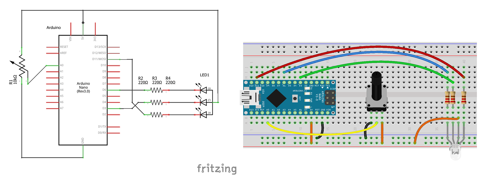

# RSD - Rolling Shutter Display Library 

Fotos   

YouTube videos  

## ¿Qué es un Rolling Shutter Display (RSD)?

Un Rolling Shutter Display, abreviado RSD, es un dispositivo capaz de producir imágenes y videos a través del conjunto de una cámara digital (CMOS) y uno o más [LEDs](https://es.wikipedia.org/wiki/Led), haciendo uso para ello, del fenómeno de interferencia entre una señal encargada de encender y apagar el/los LED/s y la frecuencia de escaneo de la cámara ([Rolling Shutter](https://es.wikipedia.org/wiki/Rolling_shutter)).

Rolling Shutter Display Library es una librería para Arduino UNO y semejantes, *Arduino Nano, Mini, Adafruit METRO 328, LilyPad Simple Board, etc; es decir, arquitecturas basadas en el microcontrolador ATmega328*. Provee métodos y funciones para sintonizar y controlar el/los LEDs, además de una interfaz de programación simple (API) para facilitar el dibujo en pantalla.

Esta librería nos permite crear un RSD con tan solo un Arduino y un LED!

## Hardware
Arduino ya trae incorporado un LED y de hecho es posible [construir un RSD con el mismo](youtube), por lo que en principio, un Arduino es todo lo que se necesita. Sin embargo para poder apreciar el fenómeno de una manera mas efectiva a través de la cámara de un celular por ejemplo, es conveniente usar un LED de alto brillo y que esté al alcance ***lo mas cercano posible de la cámara***.

### Circuito mínimo
 

El circuito mínimo es un LED conectado a *cualquiera* de los pins del Arduino con su correspondiente resistencia limitadora de corriente. 
El valor de la resistencia dependerá del color del LED y de la corriente que queramos que circule por el mismo. Hay que tener en cuenta que la máxima corriente que puede suministrar un pin de Arduino es de alrededor de 40 mA, pero se recomienda no superar los 20 mA. Para la mayoría de los casos, una resistencia de 220 Ω será suficiente. Para un cálculo más preciso te recomiendo esta [calculadora de resistencias para leds](https://www.inventable.eu/paginas/LedResCalculatorSp/LedResCalculatorSp.html).  
Otra cuestión a tener en cuenta es la orientación del LED. En el circuito propuesto el cátodo está conectado al común (GND), esta configuración se conoce como cátodo común. En LEDs de 5mm, el catodo se identifica con una marca plana en el encapsulado, y además su *terminal es más corta* que la del ánodo. No habría inconveniente de conectarlo al revés, es decir en la configuración ánodo común (en esté caso el ánodo esta conectado a positivo VCC, y el catodo a través de la resistencia al pin de Arduino); en cualquier caso, a la hora de programar tendremos que indicarle a la librería en que configuración se encuentra.  
La sintonía del RSD en este esquema la haremos a través del puerto serie.

### Circuito recomendado
 

Lista de componentes:

- 1 Arduino
- 1 LED RGB 5mm ánodo común (en lo posible difuso, si no añadiremos un difursor)
- 3 resistencias 220 Ω
- 1 Potenciómetro de entre 5 kΩ ~ 10 kΩ

El LED RGB nos permitirá obtener además de los 3 colores del mismo (rojo, verde y azul), sus combinaciones; es decir, amarillo (rojo + verde), cian (verde + azul), magenta (azul + rojo) y blanco (rojo + verde + azul). Contando el negro como un color, este modo nos permite representar 8 colores. Las mismas consideraciones respecto al LED tenidas en cuenta en el circuito mínimo valen para este caso: un LED RGB no deja de ser un conjunto de 3 LEDs.   
El potenciómetro por otro lado, proporciona un control más dinámico de la sintonía del RSD.

## Software: Instalación de la librería

- Descargar este repositorio
- En el entorno de desarrollo de Arduino (IDE), vamos a Programa > Incluir Librería > Añadir librería .ZIP
- Buscamos el fichero Zip del repositorio que acabamos de descargar y hacemos click en abrir

 

Una vez instalada la librería, vamos a cargar el primer Sketch para comprobar que todo esté en funcionamiento. Para ello vamos a Archivo > Ejemplos > RSD-master > TestScreen_One_LED (en el caso del circuito mínimo) o TestScreen_RGB_LED (en el caso del circuito recomendado).  
Una vez que cargamos el Sketch al Arduino, el LED a simple vista debería parpadear. A medida que acercamos más y más la cámara de un celular al LED, deberíamos ser capaces de ver algo similar a los siguientes patrones:

Para mejorar la nitidez y la estabilidad de la imágen debemos realizar algunos ajustes que se detallan a continuación.

## Ajustes

### Cámara

#### Distancia

La clave para obtener una buena imágen RSD es **acercar lo más posible** la cámara al LED, o viceversa; de ser posible que estén en contacto y centrados.

#### Sensibilidad fotográfica (ISO)

Cada cámara permite o no, modificar distintos parámetros en los distintos modos que posee. Para mejorar la nitidez de la imágen debemos aumentar el [ISO](https://es.wikipedia.org/wiki/Escala_de_sensibilidad_fotogr%C3%A1fica) que generalmente se accede en el modo profesional o manual.

### LED

#### Potencia 

Puede darse el caso que la cámara no permite controlar el ISO o que, por ejemplo, sí permite controlarlo en el modo de cámara profesional pero no en el modo video. La solución en esos casos es aumentar la potencia del LED.  
Aumentar la potencia además de mejorar la nitidez, también permite el uso de mejores difusores (ver a continuación) y aumenta el area y la distancia a la que puede observarse la imágen RSD. Por supuesto tiene un límite, a partir de cierto umbral la cámara se satura y cualquier color se ve blanco.   
Para aumentar la potencia hay que modificar el circuito propuesto, tema que queda fuera del alcance de este documento.

#### Difusor

  

Para conseguir que los colores se mezclen de manera uniforme es necesario un buen difusor.  
Las imagenes anteriores muestran un LED (RGB Clear/Transparente) sin y con difusor, como se puede apreciar la diferencia es notable. En este caso, se le agregó una tira de papel de cocina que resulta ser excelente para el efecto buscado. Otro material común es la silicona. Existen LEDs cuyo encapsulado es un difusor en sí (RGB Diffused/Difuso).  
Hay que tener en cuenta el compromiso entre un buen difuminado y la pérdida de potencia luminosa con la consecuente pérdida de nitidez en la imágen.

### RSD - Sintonía

Para conseguir una imágen lo más estática posible debemos sintonizar el RSD. Generalmente las cámaras de celulares trabajan a 30 cuadros por segundo, es decir 30 Hz, pero suelen encontrase también a 24 cuadros/segundo (24 Hz).  
Cada cámara tiene distinta frecuencia y las variaciones pueden ser mínimas del orden de los +-0.0001 Hz.  
En el caso del ejemplo TestScreen_One_LED, el ajuste lo realizaremos a tráves del puerto serie. Para ello en el IDE de Arduino vamos a Herramientas > Monitor serie. Una vez allí ingresamos la frecuencia, por ejemplo `30.002` y pulsamos enter.  
En el caso del ejemplo TestScreen_RGB_LED este ajuste lo realizaremos a través del potenciomentro. En el monitor serie muestra la frecuencia a la que actualmente está operando el RSD y la resolución en líneas del mismo.   

---
Enjoy!  
Made with ❤ by derfaq and the Rolling Shutter Displays Team
---

 © 2018-2020 Facundo Daguerre, esta documentación está bajo <a rel="license" href="http://creativecommons.org/licenses/by-sa/4.0/">Licencia Creative Commons Atribución-CompartirIgual 4.0 Internacional</a>.
